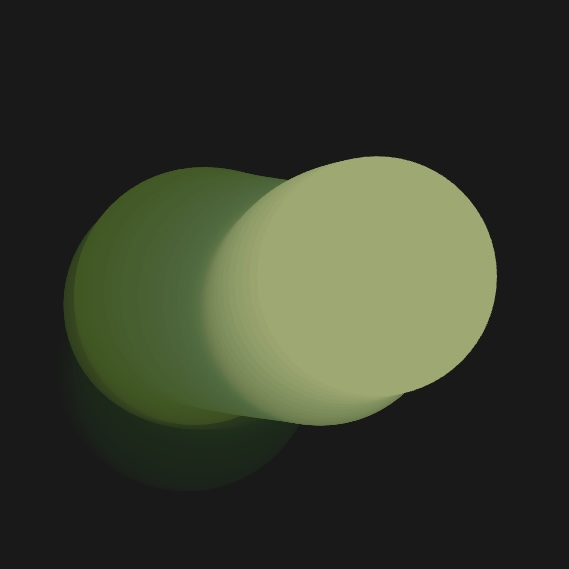
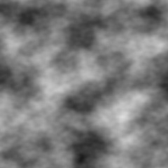

# `jluo0401_9103_Dylan`

## **Part 1: Identifying an Inspiring Imaging Technique**

> I found the **Perlin Noise** technique in p5.js particularly inspiring. Perlin Noise generates smooth, non-repetitive patterns that can mimic natural textures like clouds, smoke, or water. By manipulating noise parameters, such as scale and detail, I can create dynamic visuals that enhance the depth and realism of the imagery in my project. This technique is well-suited for interactive design, allowing the textures to respond to user inputs or environmental changes, making the visuals more engaging.

### **Visuals of Perlin Noise Effect**

  
  

## **Part 2: Coding Approach and Implementation**

> To bring the Perlin Noise effect to life, the `noise()` function in p5.js is a versatile tool that helps create continuous, smooth random values, perfect for generating natural-looking textures and animations. This function offers extensive customization through parameters like frequency, scale, and complexity, allowing for diverse visual outputs. Whether it's creating flowing water, rolling fog, or organic patterns, this coding approach provides the flexibility to enhance interactive designs.

**Example in Action**:  
Explore a working implementation of Perlin Noise using p5.js:  
- [Perlin Noise Example in p5.js](https://genekogan.com/code/p5js-perlin-noise/?ref=gorillasun.de/)